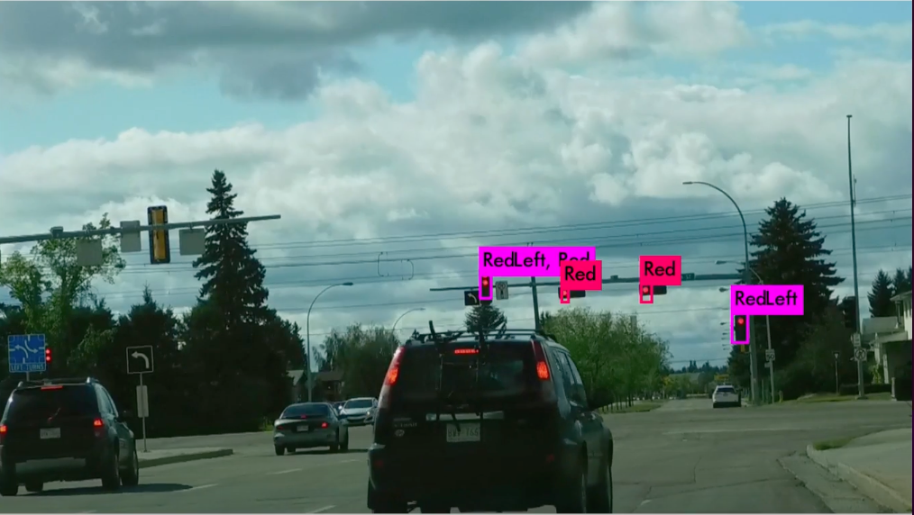

# Traffic-Light-Detection

<h2>References:</h2>

1. <a href="https://hci.iwr.uni-heidelberg.de/node/6132"> BOSCH Traffic Lights Dataset</a>
2. <a href="https://github.com/berktepebag/Traffic-light-detection-with-YOLOv3-BOSCH-traffic-light-dataset/tree/e55e09257433872089b9d148499eb976e2aca2b4"> Detecting Traffic Lights in Real-time with YOLOv3</a>
3. https://github.com/pjreddie/darknet.git
